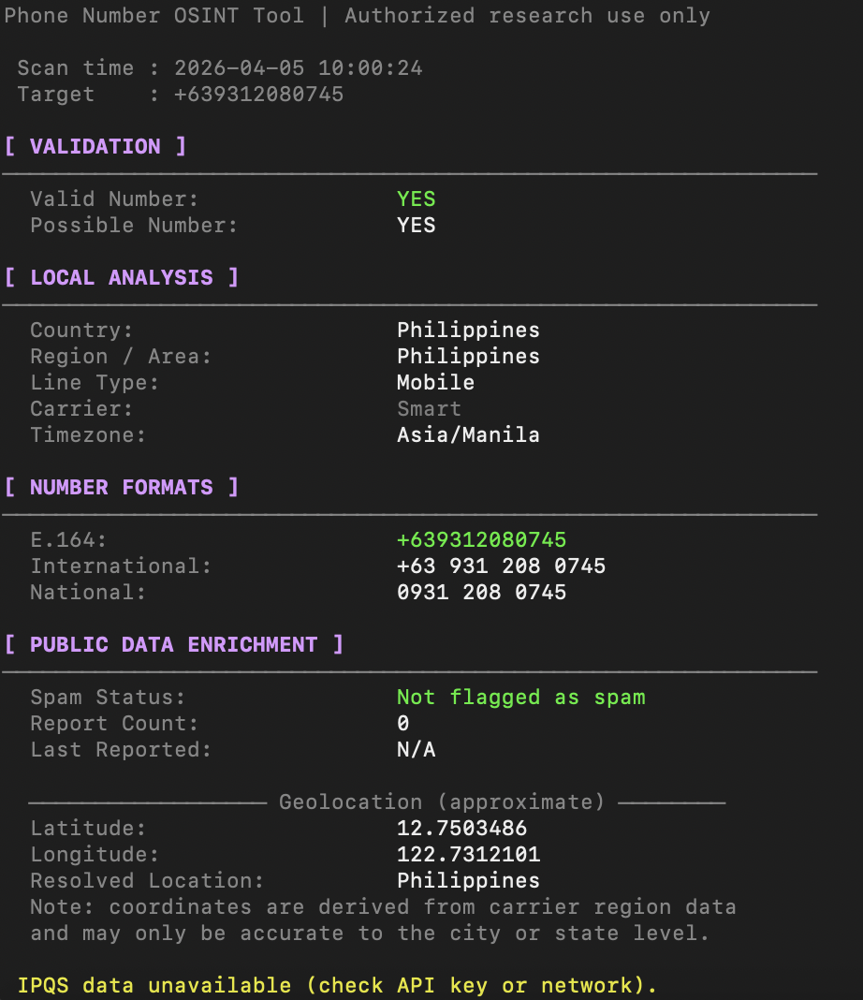
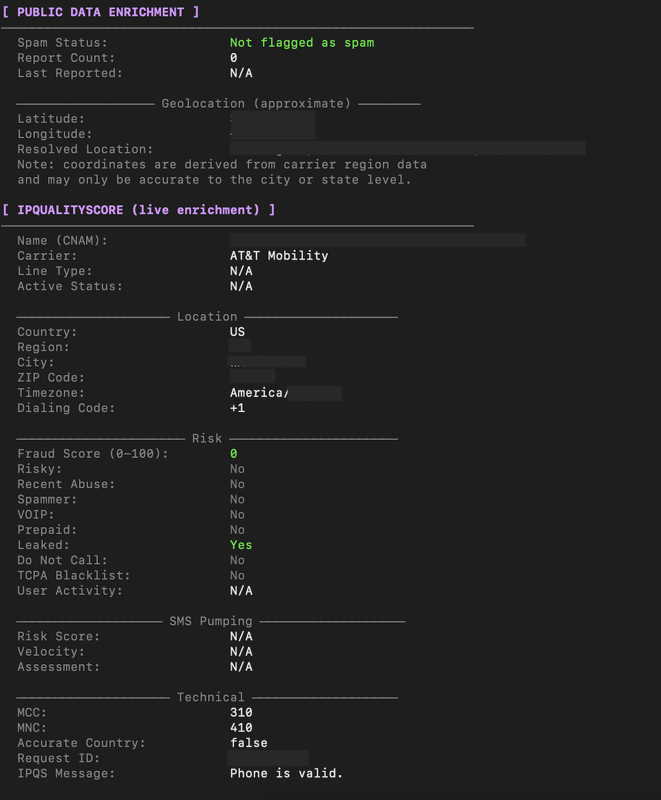
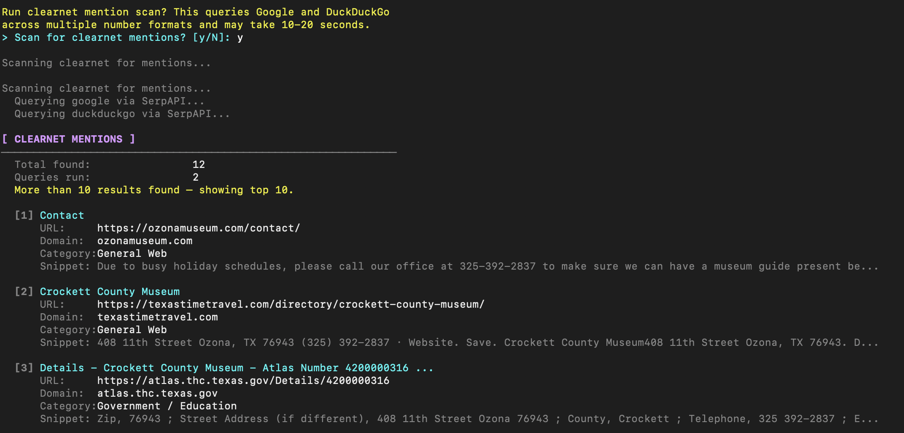
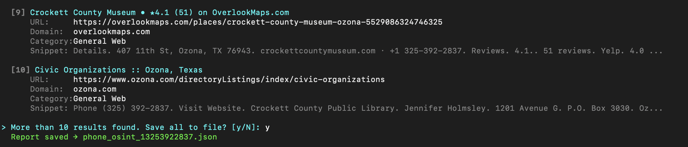
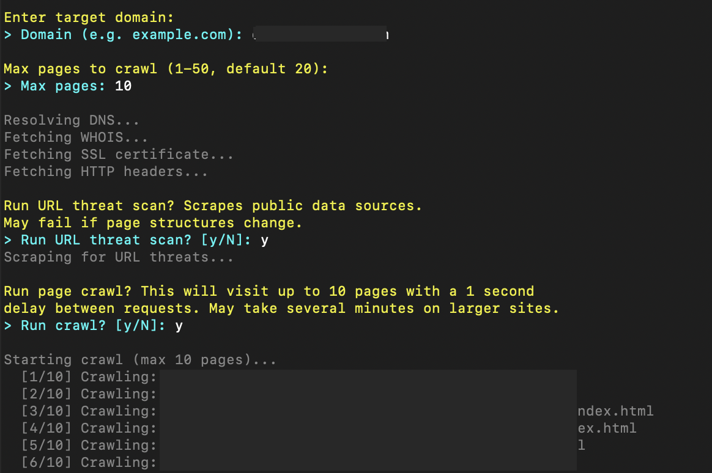
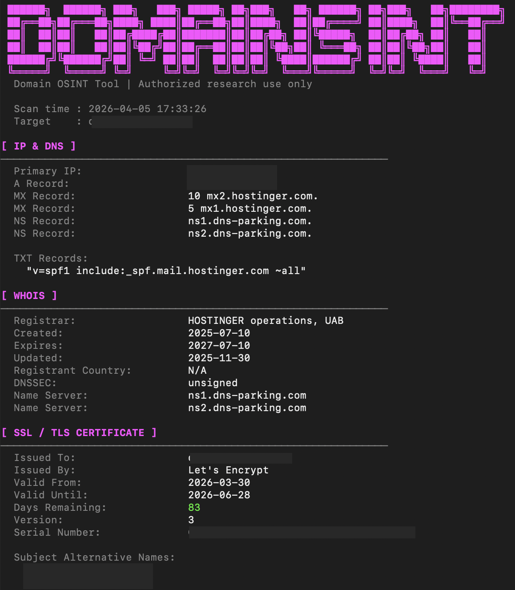
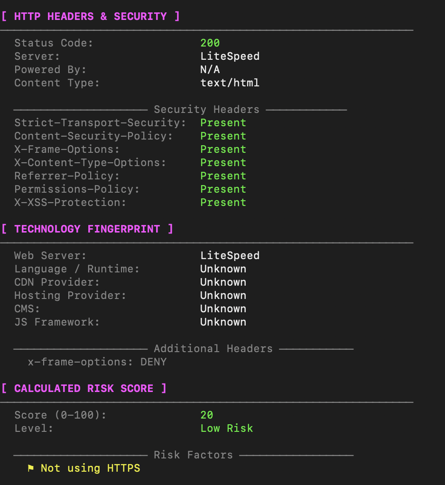
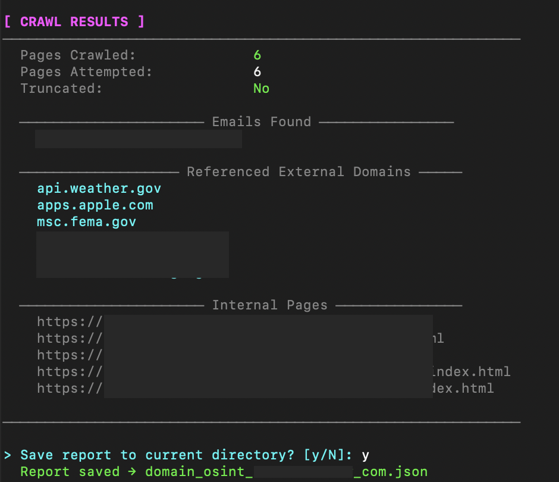

# Clear Web OSINT Toolkit - Quick start guide

## Table of Contents

- [Setup](#setup)
- [Phone OSINT Tool](#phone-osint-tool)
- [Domain OSINT Tool](#domain-url-osint-tool)

---
## Disclaimer
##### These tools are intended for authorized (where applicable) and ethical (always) use only.
##### You are responsible for ensuring your use complies with all applicable laws, regulations, and terms of services.
##### Somewhat unsurprisingly, the author (I) does (do) __not__ assume liability for any misuse.
---
## Setup

#### Assuming you have a recent version of python installed on your system:
1. Create a new folder in your desired location
2. Clone this repository or copy the desired `.py` files into that folder
3. Create a Python virtual environment inside that folder
4. Activate the virtual environment
5. Install dependencies:
```bash
   pip install -r requirements.txt
```
6. Run the tool:
```bash
   python <filename>.py
```
---
> Note: If only using one tool, install only what you need by selecting specific packages from `requirements.txt`  
---

## Tools

| Tool | File | Description |
|---|---|---|
| Phone OSINT | `c_phone_osint.py` | Phone number intelligence, spam detection, geocoding, clearnet mention scan |
| Domain OSINT | `c_domain_osint.py` | DNS, WHOIS, SSL, HTTP headers, tech fingerprint, risk score, page crawl |

---

███████████████████████████████████████████████
███████████████████████████████████████████████
## Phone OSINT Tool

### Usage
```bash
python c_phone_osint.py
```

### Optional flags
```bash
python c_phone_osint.py --save    # Saves full report to JSON after scan completes
```

### Usage flow

1. You will be prompted for country code, area code, and the rest of the number separately
2. The main report is generated immediately after
3. You will then be asked whether to run a clearnet mention scan — default is **no**
4. If the scan finds more than 10 results, you will be prompted to save the full results as a `.json` file

### How it works

- Uses phonenumbers library to assess number validity,  country, region, line type, carrier info, and timezone
- Determines spam likelihood with external query to SkipCalls service
- Determines rough geocoordinates with external query to Nominatim (openstreetmap)
- If valid IPQS API key was provided, additional data will be added to the report like Do Not Call list status
- If valid SerpApi API key was provided and clearnet mention scan ran, the tool will query SerpAPIs Google and DuckDuckGo search APIs for mentions of the number in different formats across the clear web

### Screenshots

#### Report if no valid IPQS API key:


#### What IPQS Key adds to report:


#### Clearnet mention scan (only works with valid SerpAPI Key):


#### If more than ten results:


### Notes:
#### Spam likelihood check with SkipCalls is far from perfect and will produce a lot of false negatives, but there are not many truly free services offering programmatic access to large datasets of known spam numbers so it will have to do until I find a better way

#### phonenumbers library carrier detection iffy particularly for U.S. numbers, paid services would do a better job. But would require payment. 

#### Geocoding is Region/City level not very exact (This is expected)

#### IPQS can prove to be a very difficult service to deal with. They use aggressive duplicate free account prevention software, potentially making access to the API very difficult without paying them money. When creating an account for the first time, my advice is to do so while not connected to a VPN or public Wifi network, and from a browser like Google or Safari.
---
███████████████████████████████████████████████
---

## Domain (URL) OSINT Tool

### Usage
```bash
python c_domain_osint.py
```

### Optional flags
```bash
python c_domain_osint.py --save # Saves full report to JSON after scan completes
```

### Usage flow

1. You will be prompted for the target domain and a max page crawl limit (1-50, default 20)
2. DNS, WHOIS, SSL, HTTP headers, technology fingerprint, and calculated risk score run automatically
3. You will be prompted whether to run the URL threat scan
4. You will be prompted whether to run the page crawl, which visits up to your specified limit of pages on the target domain, collecting emails, internal links, and external domain references
5. You will be prompted whether to save the report at the end, or pass `--save` to skip the prompt

### How it works

- Resolves A, PTR (reverse DNS), MX, NS, and TXT records via DNS
- Fetches WHOIS registration data including registrar, creation date, expiry, and nameservers
- Retrieves and parses the SSL/TLS certificate including issuer, expiry, days remaining, and Subject Alternative Names
- Fetches HTTP response headers and checks for the presence or absence of key security headers (HSTS, CSP, X-Frame-Options, and more)
- Fingerprints web technologies from headers and HTML including web server, CMS, JS framework, CDN, and hosting provider
- Calculates a passive risk score (0-100) derived from already collected data
- Optionally scrapes public data sources for malware, phishing, spam, and risk score data
- Optionally crawls the target domain sideways up to the page limit, extracting emails, mapping internal page links, and cataloguing all referenced external domains

### Screenshots

#### Initial prompts:


#### Main scan:



#### Crawl results (emails, external domains, internal links):


### Notes

#### The crawl uses a 1 second delay between requests out of politeness to the target server. On sites with many pages, hitting the 50 page cap will happen. The tool will warn you if links were detected but the crawl was stopped early due to the page limit, and you can always raise the limit (carefully).

#### Technology fingerprinting is based on headers and static HTML. Client-side rendered sites may not reveal their full stack this way, and some detections may be absent or inaccurate if the site actively suppresses identifying headers.

#### The URL threat scan scrapes public web pages rather than using an API. It may break if page structures change, in which case the tool should report the section as unavailable without affecting the rest of the scan.

#### Whois data availability varies. Privacy-protected domains will return minimal registrant information, and some TLDs rate-limit or straight up block whois queries entirely.

#### The calculated risk score is a passive system derived from your own scan data. It is not a substitute for a dedicated threat intelligence feed and should be treated as an indicator rather than a definitive assessment.

---
███████████████████████████████████████████████